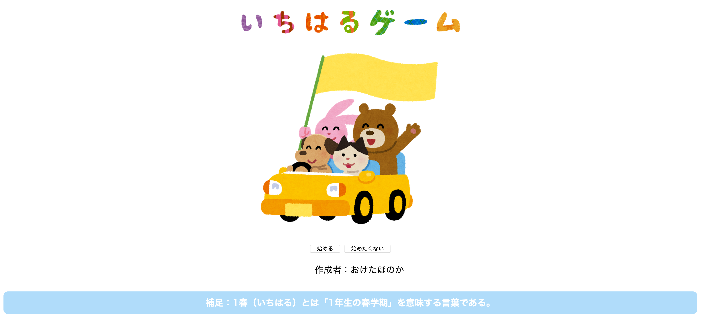

# FIT1

## 2018年度春学期情報基礎1最終課題「1春ゲーム」

### ★はじめに
私は今回情報基礎1の最終課題として「1春ゲーム」というシミュレーションゲームを製作した。  
唯一無二の作品を作成したかったので、「SFC生の1年生の春学期」に焦点を当てた「1春ゲーム」を作ることに決めた。  
「1春(1年生の春学期)」と期間を限定することで、ストーリー展開をより濃いものにすることに時間を費やせる上、この最終課題は「1春(1年生の春学期)」に受けた情報基礎1の集大成となる作品にしたかったので、「1春ゲーム」に名称を決めた。  
このゲームはSFCの特に1年生で、日常生活に疲れた方やくだらないことで笑いたい人に、1年の春学期を振り返りたい時に使ってほしい。  
また、1年生でなくて学年が上がった時プレイしても、不安もありつつ希望に満ち溢れていた1春の頃のことを懐かしむことができるようになっている。

[リンクはこちら](http://web.sfc.keio.ac.jp/~t18173ho/info1/final.html)  

 
  
### ★設計
* 複数のページリンクで繋いだ構造にする。 
* 「次へ」ボタンを押すと物語が進んでいく。 
* ストーリー分岐となる選択肢ボタンを交える。 
* JavaScript を適宜用いる。
* JavaScript を使ってユーザの入力によって表示が変化するようなページを作る。 
* ストーリーの END は全部で 5つ以上。
* CSS を用いてフォントを変える。 
* HTML、CSS、JavaScript、画像(いらすとや)の 4 種類のファイルを用いる
